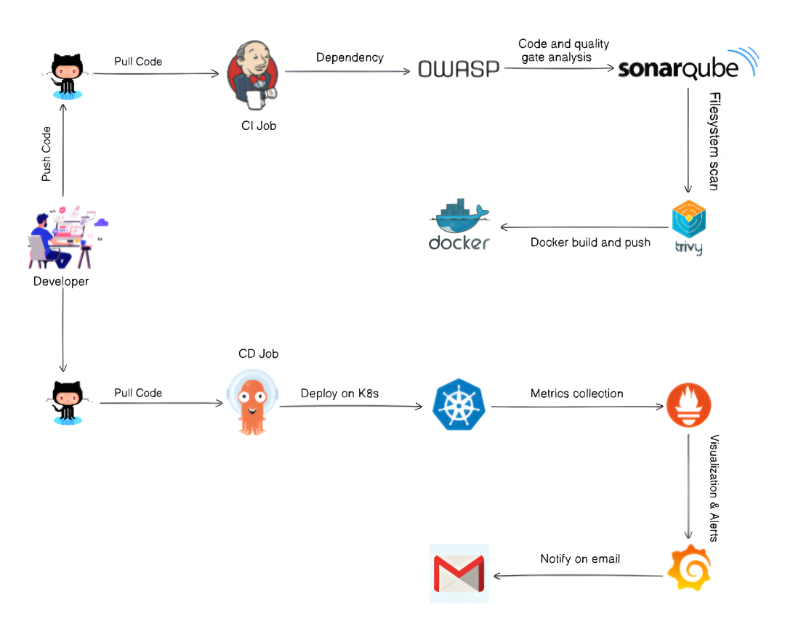
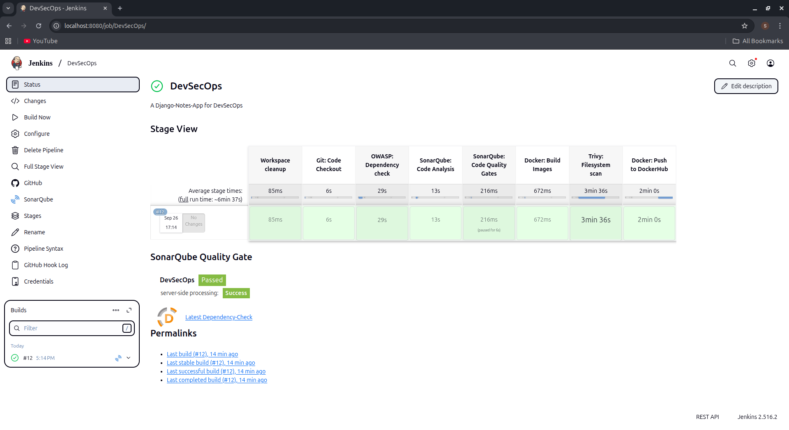
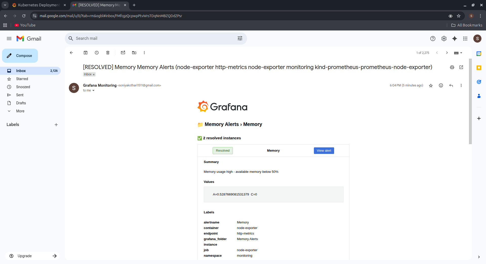

# 🚀 End-to-End DevSecOps Implementation: Automated CI/CD Pipeline, Kubernetes Orchestration & Production Monitoring 📊

This repository demonstrates a complete DevSecOps workflow for a Django application, using the original code from [Shubham Londhe's Django Notes App](https://github.com/LondheShubham153/django-notes-app.git). The project adds automated CI/CD, security scanning, containerization, GitOps-based Kubernetes deployment, and real-time monitoring.  

## Architecture

The project implements a modern DevSecOps setup:
- **CI/CD Automation:** Jenkins pipelines for building, testing, scanning, and deploying
- **Security-first Approach:** OWASP Dependency Check, Trivy, SonarQube
- **Containerization & Orchestration:** Docker images deployed on Kubernetes clusters
- **GitOps Deployment:** ArgoCD ensures automated, zero-downtime releases
- **Monitoring & Alerts:** Prometheus-Grafana with Alertmanager for proactive notifications

## DevSecOps CI/CD Pipeline

Key highlights of the pipeline:
- Automated dependency scanning for npm & pip (58 vulnerabilities detected, including critical & high)
- SonarQube quality gate ensures zero new bugs and security hotspots
- Full pipeline execution in under 7 minutes
- Docker image pushed automatically and deployed to Kubernetes via ArgoCD

## Gmail Alerts

The monitoring stack provides:
- Real-time CPU, memory, and pod availability metrics
- Alertmanager configured with Gmail SMTP for instant notifications
- Automated alert firing and resolution workflows

## Conclusion
This project demonstrates a production-ready DevSecOps workflow where security, automation, observability, and reliability are integrated end-to-end. The setup ensures fast development cycles, secure code, and fully monitored production deployments.

---

**Author:** Soniya Kothari
